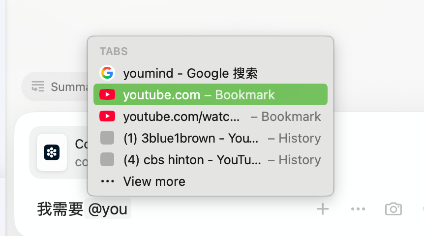

对于我们的微应用所设计的这个调音AI，之前其所有的能力是：
1. 能看到当前的滤波器设置。
2. 能通过输出的特定格式内容，编辑对应的滤波器。

现在我们有一个新的后端服务：
其作用是：
用户输入类似："我想要A耳机的高频，B耳机的低频。"
LLM将对应需求转换为符合：`coverSegementFromLLM`的传入。
datagroup不用管。
我们微前端解析之后，带着LLM整理好的参数，请求对应的父应用方法。

这还需要前置的其他修改：
1. LLM不知道我们产品的准确名字&LLMID，这需要用户在query LLM的时候就给到，因此：
   这需要，用户能够通过 `evaluation`接口，去拿到这个内容，具体来说：
   用户需要一个类似模糊搜索的工具在前端，一旦检测到用户输入 @ 或者其他字符
   触发这个功能。
   要求： 
   类似这个图的效果。（被选的项目是 产品的名字）
   用户输@之后，会有一个高亮在这里。
   用户一旦选定，则：类似这里，选定之后，用户的搜索框里面会呈现出这样一个被高亮过的产品名字（ie800，榭兰图）。
   与此同时，这个高亮过的文本需要对应的是一个被特定符号包裹的元信息（我们可以定义<user_selected_item>{"name":"耳机名","uuid":"耳机uuid"}</user_selected_item>）这个内容对用户是不可见的，但是是最后发给LLM的内容。
   只有有符合这个条件的内容，LLM才会使用对应的能力。
2. 需要考虑对应的渲染逻辑，信息展示逻辑。
3. 要考虑用户有没有可能会出现什么错误的修改，导致破坏了那部分的元数据，一定要避免的情况是，LLM输出了一个调用父方法的请求，但是请求里面的uuid是错误的/数据库没有的。

---

# 📋 需求理解与技术方案（确定版）

## 一、需求理解

### 1.1 核心业务场景

**用户痛点**：想要混合多个耳机的优点进行调音
- **输入示例**："我想要 IE800 的高频，榭兰图的低频"
- **预期结果**：系统自动覆盖对应频段的频响数据

### 1.2 当前能力边界

**已有能力**：
- ✅ AI 可查看当前滤波器状态
- ✅ AI 可通过 `<freq_manipulation>` 标签增删改滤波器

**缺失能力**：
- ❌ AI 不知道产品的准确名称和数据库 UUID
- ❌ 用户无法精准指定耳机产品
- ❌ 无法实现频段覆盖功能

### 1.3 解决方案概述

**新增交互流程**：
```
用户输入 @ → 触发产品搜索 → 选择耳机 →
高亮显示 (UI) + 元数据注入 (数据) →
发送给 LLM (含元数据) → LLM 解析需求 →
返回 coverSegment 指令 → 前端调用父应用方法
```

---

## 二、技术方案设计

### 2.1 前端产品选择器 (Product Mention System)

#### 2.1.1 交互触发机制

**触发条件**：
- 用户输入 `@` 字符
- 光标位置在 `@` 后面

**UI 响应**：
- 弹出浮动面板（Popover/Dropdown）
- 显示搜索框 + 产品列表
- 支持键盘导航（↑↓ 选择，Enter 确认，Esc 取消）

#### 2.1.2 产品搜索 API 集成

**调用接口**：通过微应用后端代理调用 HuiHiFi API

**前端请求**：
```typescript
// 前端调用微应用后端
POST /api/products/search

// 请求参数
{
  "keyword": "用户输入的关键词",
  "pageSize": 20
}
```

**后端转发**：
```python
# Flask 后端转发到 HuiHiFi API
POST https://huihifi.com/api/v1/openapi/evaluations

# 请求参数
{
  "orderBy": "createTime",
  "direction": "DESC",
  "pageSize": 20,
  "keyword": "用户输入的关键词"
}

# 请求头（后端处理签名）
{
  "appKey": "...",
  "timestamp": "...",
  "sign": "..."  # SHA256(appKey + timestamp, secretKey) -> Base64
}
```

**响应数据提取**：
```json
{
  "uuid": "产品UUID",
  "title": "产品标题",
  "brand": { "title": "品牌", "img": "品牌图" },
  "article": { "thumbnails": ["产品图"] }
}
```

**列表展示**：
- 产品缩略图 + 品牌名 + 产品名
- 支持实时模糊搜索（输入时 debounce 300ms）
- 最多显示 10-20 条结果

#### 2.1.3 选中后的数据处理

**数据结构设计**：

```typescript
// 内部数据模型
interface MentionedProduct {
  id: string;              // 用于前端唯一标识
  name: string;            // 产品名（用户可见）
  uuid: string;            // 数据库UUID（发给LLM）
  displayText: string;     // 显示文本 = name
}

// 消息数据结构
interface UserMessage {
  plainText: string;       // "我想要 IE800 的高频"
  richContent: Array<      // 富文本片段
    | { type: 'text', content: string }
    | { type: 'mention', data: MentionedProduct }
  >;
  llmPayload: string;      // 发给LLM的文本（含元数据）
}
```

**元数据格式**：
```xml
我想要<user_selected_item>{"name":"IE800","uuid":"abc-123"}</user_selected_item>的高频
```

#### 2.1.4 UI 渲染实现

**技术方案**：**ContentEditable + 自定义渲染**

**实现细节**：
```tsx
// 使用 contenteditable 实现富文本编辑
<div
  contentEditable={true}
  onInput={handleInput}
  onKeyDown={handleKeyDown}
>
  我想要
  <span
    contentEditable={false}
    className="mention-chip"
    data-mention-id="xxx"
  >
    IE800
  </span>
  的高频
</div>
```

**关键特性**：
- Chip 为 `contentEditable={false}` 不可编辑元素
- 监听 `input` 事件，解析用户输入
- 通过 `data-mention-id` 关联元数据
- 删除时整体删除（监听 Backspace 键）

#### 2.1.5 用户编辑保护机制

**问题场景**：
- 用户删除 Chip 后手动输入产品名 → 元数据丢失
- 用户复制粘贴破坏了元数据结构

**保护策略**：

1. **Chip 原子性**：
   - Chip 作为一个不可分割的单元
   - 删除时整体删除（Backspace 删除整个 Chip）
   - 禁止在 Chip 内部插入光标

2. **元数据同步**：
   - 维护 `richContent` 数组作为 single source of truth
   - UI 输入时同步更新数组
   - 提交时从数组生成 `llmPayload`

3. **粘贴处理**：
   - 拦截粘贴事件
   - 提取纯文本，丢弃格式
   - 如果粘贴内容包含 `<user_selected_item>`，验证 JSON 有效性

4. **提交前校验**：
   - 验证所有 mention 的 UUID 格式正确
   - （可选）调用 API 验证 UUID 是否存在

---

### 2.2 后端 LLM 服务扩展

#### 2.2.1 新增 Prompt 指令

**扩展 System Prompt**（`aiConfig.ts`）：

```typescript
const SYSTEM_PROMPT = `
... (原有 Prompt)

## 新能力：频段覆盖 (Segment Cover)

当用户使用 @ 提及产品时，消息中会包含隐藏的元数据：
<user_selected_item>{"name":"产品名","uuid":"产品UUID"}</user_selected_item>

如果用户表达了混合多个产品的频响需求（如"我想要A的高频，B的低频"），
你需要输出以下格式的指令：

<segment_cover>
{
  "data_list": [
    {
      "frequency_range": [20, 500],     // 频率范围 (Hz)，根据用户描述灵活判断
      "name": "榭兰图",                  // 产品名
      "uuid": "xxx-xxx-xxx",            // 产品UUID（从元数据提取）
      "dataGroup": ""                    // 留空
    },
    {
      "frequency_range": [5000, 20000],
      "name": "IE800",
      "uuid": "yyy-yyy-yyy",
      "dataGroup": ""
    }
  ]
}
</segment_cover>

注意事项：
1. 必须从 <user_selected_item> 中提取 UUID，不得猜测或编造
2. frequency_range 根据用户描述的频段范围灵活确定（理解用户意图，如"低频"、"人声"、"高音"等）
3. 如果用户没有使用 @ 提及产品，或元数据缺失，则回复"请使用 @ 选择具体产品"
`;
```

#### 2.2.2 后端解析逻辑

**API 响应格式**（后端实现）：

```typescript
// SSE 流式响应中新增事件类型
{
  "event": "segment_cover",
  "data": {
    "data_list": [...]
  }
}
```

**验证逻辑**：
- 检查 UUID 是否在数据库中存在
- 验证 frequency_range 合理性（20-20000 Hz）
- 确保 data_list 不为空

---

### 2.3 前端解析与调用

#### 2.3.1 扩展流式响应处理

**修改位置**：`hooks/useStreamingLLM.tsx`

```typescript
// 在 parseAllManipulationTags 旁新增
function parseSegmentCoverTag(content: string): SegmentCoverData | null {
  const regex = /<segment_cover>([\s\S]*?)<\/segment_cover>/;
  const match = content.match(regex);
  if (!match) return null;

  try {
    const data = JSON.parse(match[1]);
    // 验证数据结构
    validateSegmentCoverData(data);
    return data;
  } catch (e) {
    console.error('解析 segment_cover 失败:', e);
    return null;
  }
}

// 在 sendMessageToLLM 中添加处理
if (fullResponse.includes('<segment_cover>')) {
  const segmentData = parseSegmentCoverTag(fullResponse);
  if (segmentData) {
    // 存储到消息的 segmentCoverAction 字段
    manipulationActions.segmentCover = segmentData;
  }
}
```

#### 2.3.2 调用父应用方法

**新增组件**：`components/SegmentCoverAction.tsx`

```typescript
// 类似 ManipulationAction，用于展示和执行频段覆盖操作
interface Props {
  segmentData: SegmentCoverData;
  onApply: (data) => void; // 调用父应用的 coverSegmentFromLLM
}

// UI 展示：
// - 标题："频段覆盖操作"
// - 列表显示每个产品的覆盖范围（产品名 + 频率范围）
// - "应用"按钮 → 调用 onApply(segmentData.data_list)
```

**父应用回调扩展**（`App.tsx`）：

```typescript
interface AppProps {
  callbacks?: {
    addFilterFromLLM: (params) => void;
    editFilterFromLLM: (id, params) => boolean;
    deleteFilterFromLLM: (id) => boolean;
    coverSegmentFromLLM: (data_list) => void;  // 新增
  };
}

// 在 Context 中透传
const callbacks = {
  ...props.callbacks,
  coverSegmentFromLLM: (data) =>
    props.callbacks?.coverSegmentFromLLM?.(data)
};
```

---

### 2.4 类型定义扩展

**修改位置**：`types.ts`

```typescript
// 产品提及
export interface MentionedProduct {
  id: string;
  name: string;
  uuid: string;
}

// 频段覆盖数据
export interface SegmentCoverItem {
  frequency_range: [number, number];
  name: string;
  uuid: string;
  dataGroup: string;
}

export interface SegmentCoverData {
  data_list: SegmentCoverItem[];
}

// 扩展 ChatMessage
export interface ChatMessage {
  // ... 原有字段
  richContent?: Array<
    | { type: 'text'; content: string }
    | { type: 'mention'; data: MentionedProduct }
  >;
  segmentCoverAction?: SegmentCoverData;
}
```

---

### 2.5 错误处理与边界情况

#### 2.5.1 UUID 验证策略

**前端预检**：
```typescript
function validateUUID(uuid: string): boolean {
  // UUID v4 格式检查
  const regex = /^[0-9a-f]{8}-[0-9a-f]{4}-4[0-9a-f]{3}-[89ab][0-9a-f]{3}-[0-9a-f]{12}$/i;
  return regex.test(uuid);
}
```

**后端二次验证**：
- 查询数据库确认 UUID 存在
- 返回错误时前端显示："产品不存在，请重新选择"

#### 2.5.2 元数据丢失处理

**场景1**：用户删除 Chip 后手动输入产品名
- **检测**：提交时检查是否有纯文本产品名但无对应 mention
- **提示**："请使用 @ 选择产品以确保准确识别"

**场景2**：用户编辑破坏了元数据
- **保护**：禁止直接编辑 `llmPayload` 字符串
- **恢复**：从 `richContent` 数组重新生成

#### 2.5.3 API 调用失败处理

**评测产品列表 API 失败**：
- 显示"搜索失败，请重试"
- 提供手动刷新按钮
- 超时设置 10s

**频段覆盖 API 调用失败**：
- 捕获父应用回调异常
- 显示错误信息："覆盖失败：[错误原因]"
- 允许重试

---

## 三、实施路线图

### 阶段 0：后端 API 代理开发（前置依赖）
1. **Flask 后端添加产品搜索接口** - `/api/products/search`
2. **实现 HuiHiFi API 签名逻辑** - SHA256 + Base64
3. **API 转发与错误处理** - 超时、重试、错误码映射
4. **接口测试** - Postman 或单元测试验证

**详细计划见**：`backend-api-proxy-plan.md`

---

### 阶段 1：基础设施搭建（前端）
1. **类型定义** - 扩展 TypeScript 类型（`types.ts`）
2. **产品搜索服务** - 封装后端 API 调用（`services/productSearch.ts`）
3. **工具函数** - UUID 验证、元数据解析

### 阶段 2：产品选择器开发
1. **@ 触发检测** - 监听输入事件（`ChatInputArea.tsx`）
2. **下拉面板 UI** - 产品列表 + 搜索框（`ProductSearchDropdown.tsx`）
3. **Chip 组件** - 可删除的高亮标签（`MentionChip.tsx`）
4. **富文本编辑器** - ContentEditable 集成（`RichTextInput.tsx`）
5. **数据同步** - richContent ↔ llmPayload

### 阶段 3：LLM 集成
1. **Prompt 扩展** - 添加 segment_cover 指令（`aiConfig.ts`）
2. **元数据注入** - 发送消息时包含元数据（`useStreamingLLM.tsx`）
3. **响应解析** - 提取 `<segment_cover>` 标签（`aiConfig.ts`）
4. **UI 展示** - SegmentCoverAction 组件

### 阶段 4：父应用集成
1. **回调扩展** - 添加 coverSegmentFromLLM（`App.tsx`）
2. **调用测试** - 验证数据格式正确性
3. **错误处理** - 捕获异常并显示

### 阶段 5：测试与优化
1. **边界测试** - 无网络、API 失败、无效 UUID
2. **用户体验优化** - 键盘快捷键、加载状态
3. **性能优化** - 搜索防抖、结果缓存

---

## 四、关键技术决策（已确定）

### 4.1 富文本编辑方案

**选定方案**：**ContentEditable + 自定义渲染**

**理由**：
- 编辑体验更自然，光标处理原生支持
- Chip 元素通过 `contentEditable={false}` 实现不可编辑
- 虽然需要处理跨浏览器兼容性，但一次性投入，长期收益更高

**实现要点**：
- 监听 `input`、`keydown`、`paste` 事件
- 通过 `data-mention-id` 关联元数据
- Selection API 处理光标位置

### 4.2 API 签名安全性

**选定方案**：**后端代理**

**架构**：
```
前端 → 微应用 Flask 后端 → HuiHiFi API
     (不暴露密钥)    (签名处理)
```

**优点**：
- 密钥完全不暴露在前端
- 便于统一管理 API 调用
- 可在后端实现缓存、限流等功能

### 4.3 元数据格式

**选定格式**：XML 标签包裹 JSON
```xml
<user_selected_item>{"name":"IE800","uuid":"abc-123"}</user_selected_item>
```

**理由**：
- 更明确的语义边界
- 便于正则提取：`/<user_selected_item>([\s\S]*?)<\/user_selected_item>/g`
- 不与 Markdown 语法冲突
- LLM 更容易识别和解析

---

## 五、验收标准

### 5.1 功能验收
- [ ] 用户输入 `@` 后弹出产品搜索面板
- [ ] 搜索框支持实时模糊搜索
- [ ] 选择产品后显示为高亮 Chip
- [ ] Chip 可整体删除，不可部分编辑
- [ ] 提交消息时正确生成元数据
- [ ] LLM 正确解析元数据并返回 segment_cover 指令
- [ ] 前端正确调用 `coverSegmentFromLLM`
- [ ] 父应用成功接收并处理数据

### 5.2 异常处理验收
- [ ] 无效 UUID 时显示错误提示
- [ ] API 调用失败时有重试机制
- [ ] 用户手动破坏元数据时有保护措施
- [ ] 网络超时时有友好提示

### 5.3 用户体验验收
- [ ] 搜索响应时间 < 500ms
- [ ] 键盘导航流畅（↑↓Enter Esc）
- [ ] 移动端适配良好
- [ ] 加载状态清晰可见

---

## 六、风险评估

| 风险 | 影响 | 概率 | 缓解措施 |
|------|------|------|----------|
| ContentEditable 跨浏览器兼容性 | 中 | 中 | 充分测试主流浏览器、使用 Polyfill |
| UUID 验证绕过 | 高 | 低 | 前后端双重验证 |
| LLM 解析失败 | 中 | 中 | Prompt 优化、错误重试 |
| 性能问题（大量产品） | 低 | 低 | 虚拟滚动、分页加载 |
| 后端 API 代理延迟 | 低 | 低 | 缓存优化、监控响应时间 |

---

**文档版本**: v2.0（确定版）
**最后更新**: 2025-10-31
**协作者**: Claude & 李驰豪
